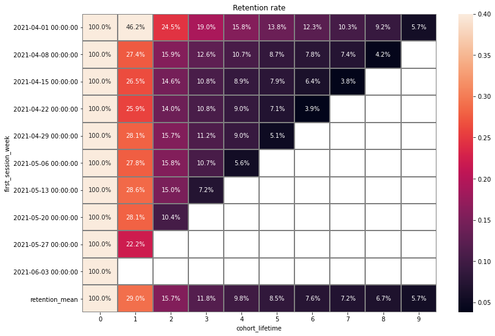
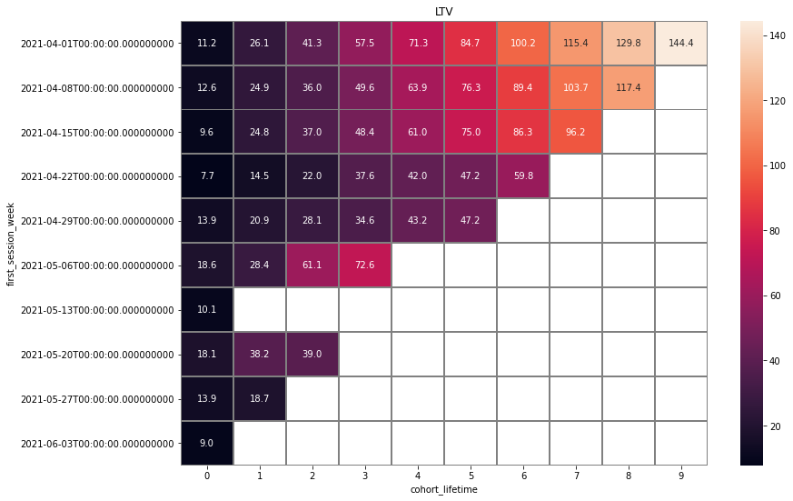

# Norbu app analysis

## Project's goal
Provide recommendations to increase retention rate based on app data analysis. 
Data available: user activity logs, user ltv, geography, devices, traffic source.

## Product 
Norbu is a healthcare mobile app, which provides different techniques to cope with stress: meditation, breathing, games to improve focus. The app profits from paid subscriptions, bought by users.
### What does Norbu promise to the user? 
Help control stress

## First open/Onboarding

- Options do not correspond to the question, **recommendations or question should be reformulated**: 
 "what worries you" - "trouble falling asleep"
or
 "what would you like to achieve" - "Improve sleep"

- Reduce decision fatigue, simplify behavior: add default options here and on an exercise screen, e.g. "training of the day".

## Event funnel
Most popular exercices are: breathing and ball game. 
Let's investigate the breathing exercise:



8% of people do not proceed from the exercise screen to the exercise itself.

- There should be **less barriers between intention to exercise and the exercise itself**: more screens/clicks - more opportunities for the user to change one's mind. Remove one screen between choosing the exercise and starting the exercise. There should be just 2 clicks: choose the exercise and start the exercise.
- 30% of users who started breathing exersice do not finish it. Use in app messaging as an extrinsic motivation, e.g. praise for good effort or focus on the goal (which user selected during onboarding or smth general): "One step closer to your goals" or "Thank you for taking care of oneself". Or promote social connection. [Reference](https://www.braze.com/resources/articles/in-app-message-best-practices)

## Retention

**Average retention rate is pretty normal**. Headspace (industry leader): By Day 30 has average retention percentages around 8%. [Reference](https://www.theneura.com/headspace-mobile-engagement-strategy/)

## LTV

## User activity

Overall number of daily events correlates with the number of daily unique users, which is good, as there are no heavy-users, whom it would be risky to lose.

## App removal
Share of users who remove the app is around 50% which corresponds to average uninstall rate in the mobile app industry [Reference](https://www.mobileappdaily.com/reduce-mobile-app-uninstall-rates). That's why we did not dig into reasons of app removal, as the rate is pretty normal. We would **suggest to subscribe a new user to the emails by default**, interesting email might return a user, who has already removed an app. 

## Inactive users
We decided to consider users who haven't used an app for more than 10 days, but haven't uninstalled the app - to be inactive users.
**There are around 30% of inactive users.**


## Geographical distribution

Middle East and Europe are leading regions in number of unique users.


Germany and Iran are responsible for 50% of all unique users.


The most active city is Tehran.

## Traffic sources


There are just two significant traffic sources for now. 
- Probably, it will make sense to **choose another potentially successful traffic source to develop**: e.g. social networks. 
- Plus, improve existing sources, for example, **perform Google Play Optimization (if not yet)**. Currently, not all key words result in finding Norbu app: meditation, mindfullness, breathing do not work, stress/stress control works.
- We would recommend to **start a referral program**, invites with promocodes as it could be a new channel of traffic, plus - social connection promotes retention.

## OS and devices
**Android OS and mobile phones are the most popular choices**. It would be interesting to know why the app isn't yet popular on iOS? is it new or lacks some functionality? 

## Conclusion
1. Retention and uninstall rate are pretty normal comparing with other mobile apps. Several different strategies to improve retention were proposed.
2. It would be interesting to learn why Iran and Germany have so many Norbu users: was this a result of a marketing campaign or the way Google Play positions Norbu app in these countries?
3. We would recommend to diversify OS, traffic sources and attract users from different countries.

